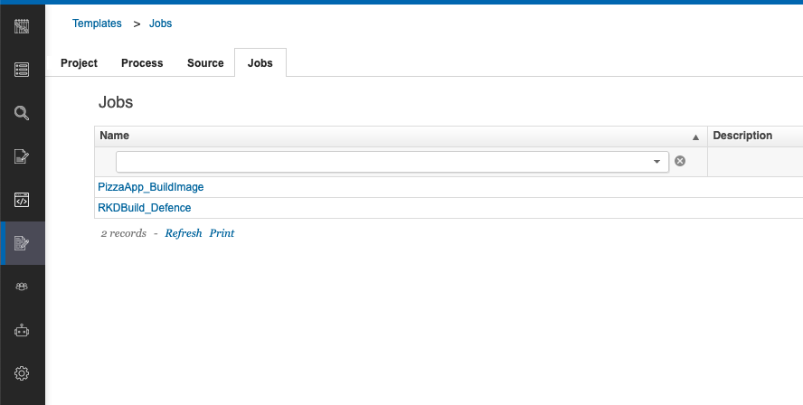
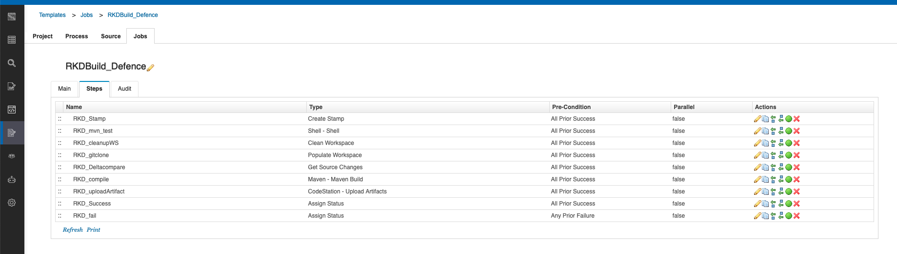

# Build Lab

## Introduction

## How to switch to Build from Home Page

You can switch to ConBuildrol by either pressing "Let's go to Control" button on its tile:

Or you can always switch using the central app switcher on the top left of your screen:

## Overview

### Build Project Runs

### Build Process Detail

## Templates

### Project Templates

### Process Templates

#### Process Template Detail

#### Process Template Definition

### Source Templates

### Job Templates

#### Job Template Steps

#### Job Template Step Detail

