# Demo Flow

## [Loop](introduction/index.md)

1. [Show Home Page](introduction/index.md#the-home-page)
    1. click on Home button in the side bar to switch to the Home Page
    2. 
    3. 
    4. and explain that we have a lot of metrics.

## [Plan](plan/index.md)

1. [Open Plan](plan/index.md#how-to-switch-to-plan-from-home-page)
    1. [Show a board](plan/boards/index.md#project-board)
        1. 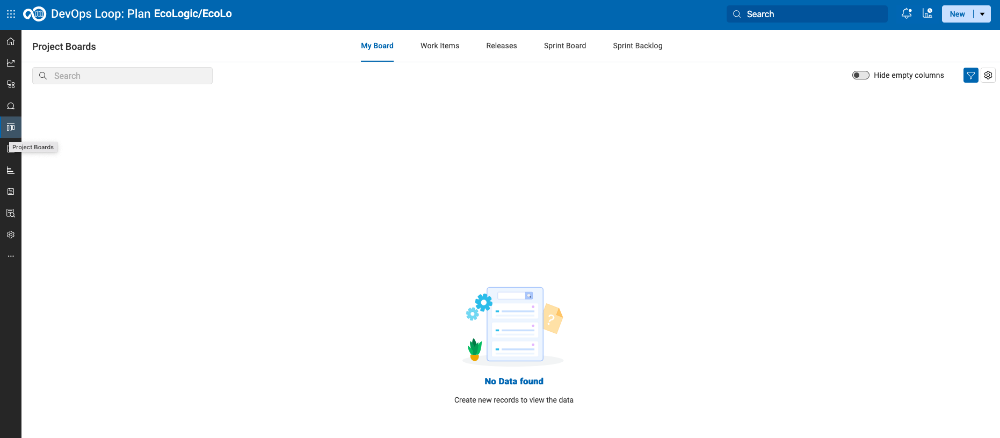
    2. [Show how to filter out Epics](plan/boards/index.md#filter-epics)
        1. 
    3. [Show all work items](plan/boards/index.md#work-items)
        1. 
    4. [Select and Show the details of a work item](plan/boards/index.md#select-workitem)
        1. 
        2. 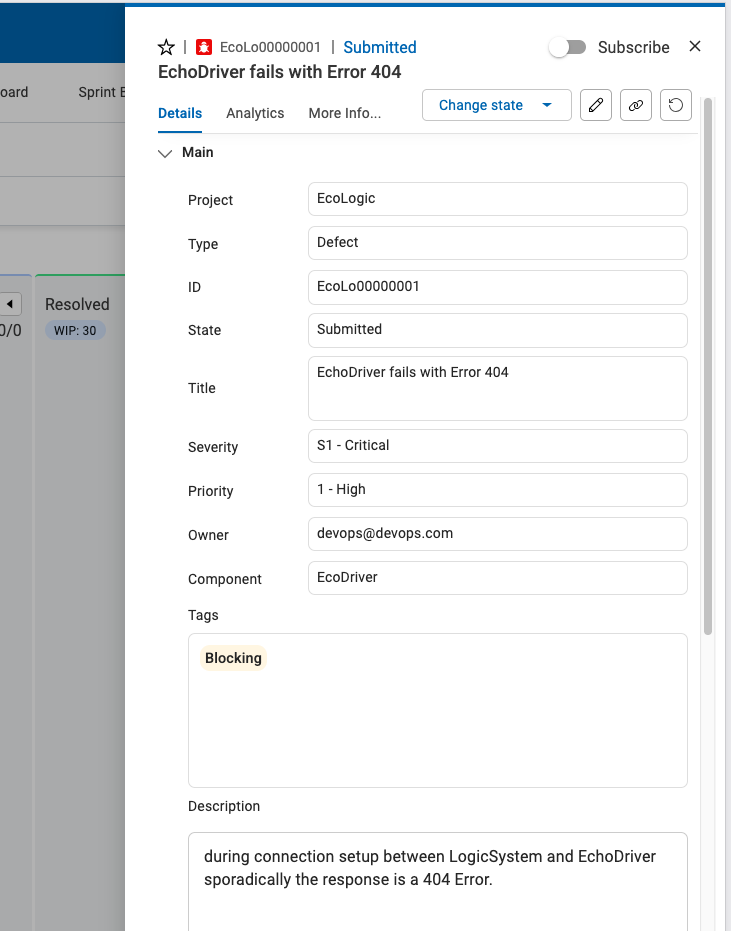
    5. [Show the link between work item to code and explain how easy it is to have traceability](plan/boards/index.md#show-commit)
        1. 
        2. 
    6. [Open a workitem and use AI to create description and exploratory test information](plan/boards/index.md#use-ai-in-workitem)

## [Code](code/index.md)

1. Explain that we showed the link between a work item and the code in control.
2. [Now open CODE](code/index.md#how-to-switch-to-code-from-home-page) ( use VScode for now, Switch to DevOps Code later)
    1. [Use WCA to explain code and generate some new code](code/index.md#watsonx-code-assistant).
        1. 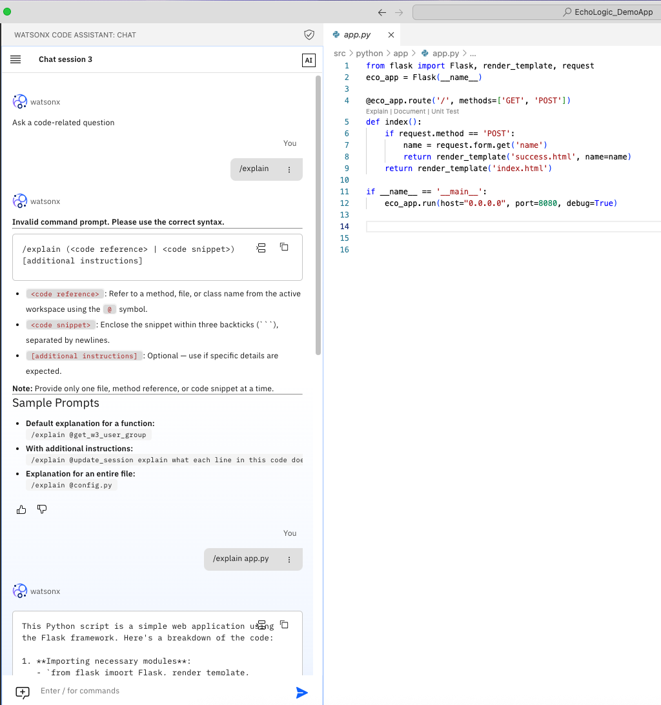
        2. 
    2. [Push code and add comment with work item number](code/index.md#commit-code-with-wi).
        1. 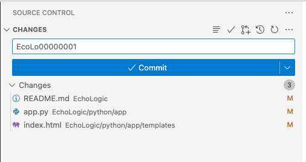
    3. [Open Control and show the update](#control).

## [Control](control/index.md)

1. [Open Control](control/index.md#how-to-switch-to-control-from-home-page)
    1. [Show the Update](control/index.md#show-activity-report) in the activity report of the repository
    2. Activity Report: 
    3. Git Commit Details: 

## [Build](build/index.md)

1. [Open Build](build/index.md#how-to-switch-to-build-from-home-page)
    1. [Show overview on build runs and results](build/index.md#build-project-runs)
        1. 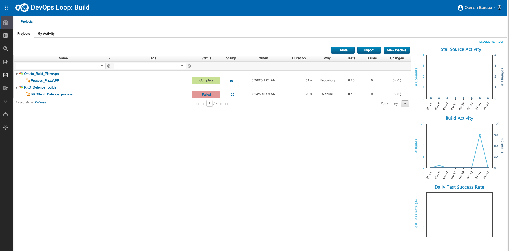
    2. [Show build process](build/index.md#build-process-detail)
        1. 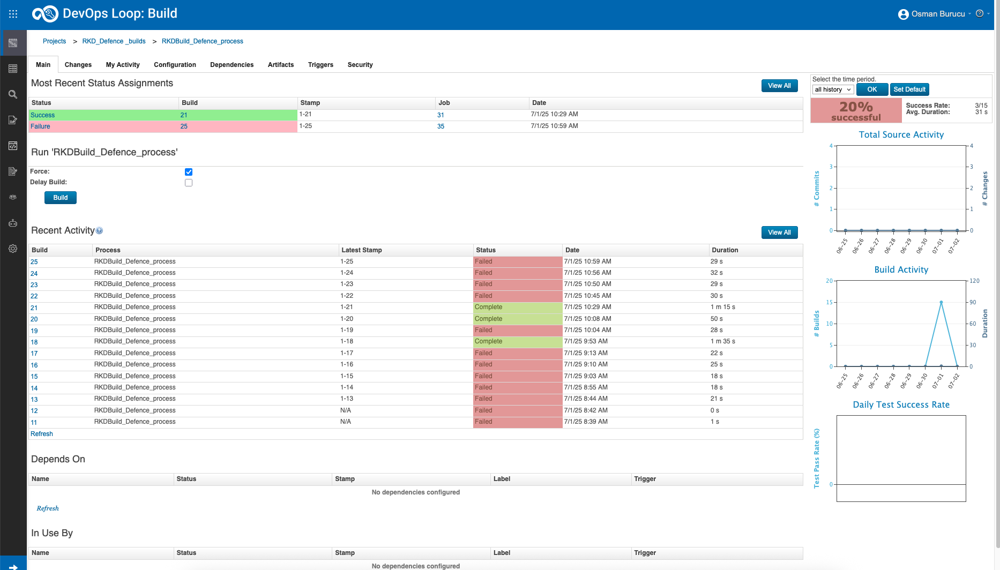
    3. [Show templates](build/index.md#templates)
        1. 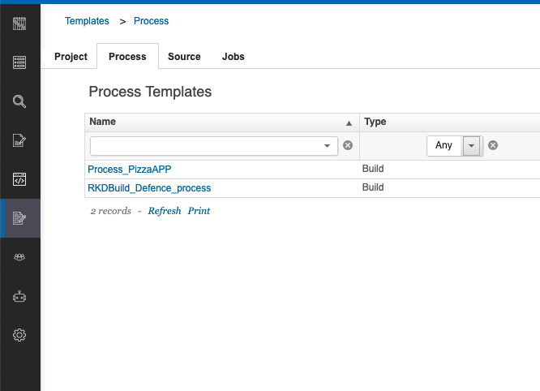

## [Deploy](deploy/index.md)

1. [Open Deploy](deploy/index.md#how-to-switch-to-deploy-from-home-page) by [Using the ‘What would you like to do today’ and select Deploy](deploy/index.md#what-would-you-like-to-do-today)
    1. [Show the landing page and explain the metrics](deploy/index.md#deploy-landing-page)
        1. 
    2. [Show process (components, app)](deploy/index.md#processes)
        1. Component Process: 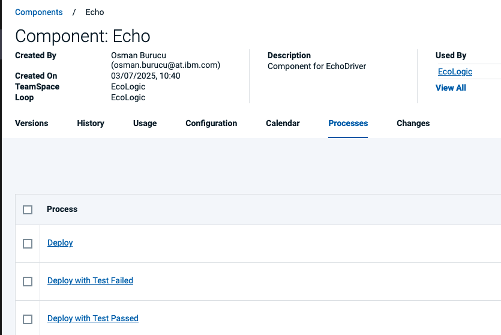
    3. [Edit process](deploy/index.md#process-designer)
        1. 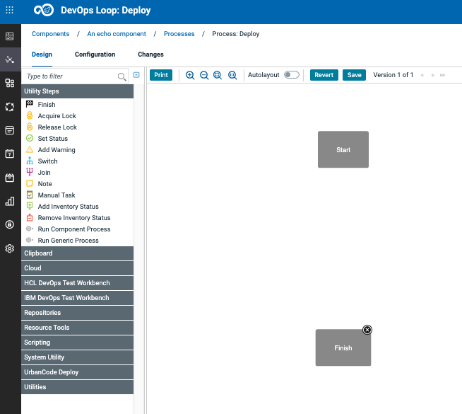
    4. [show a process which executes a TEST with setting quality tag on version.](deploy/index.md#adding-version-statuses)
        1. 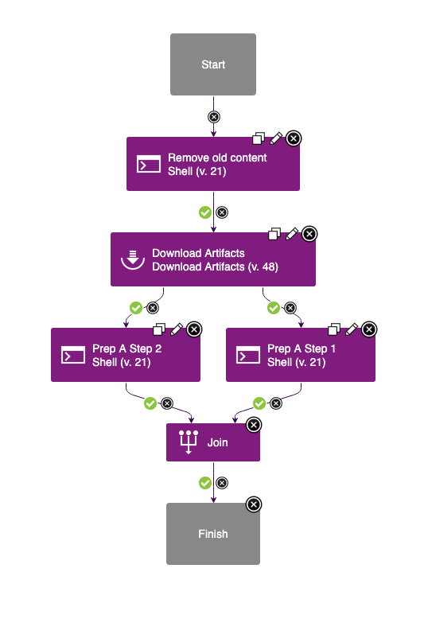
        2. TODO: add test script step as soon as TEST is ready
    5. [Run and view results of steps](deploy/index.md#run-a-deployment)
        1. 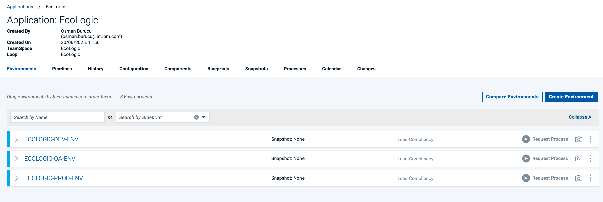
        2. click on Request Process Button: 
        3. 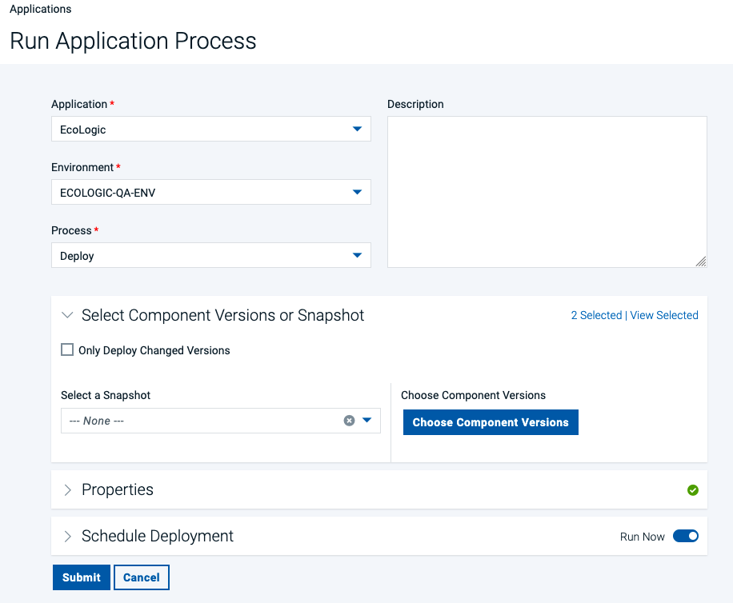
    6. [Show result (environment and version changes of comp)](deploy/index.md#result-of-run).
        1. 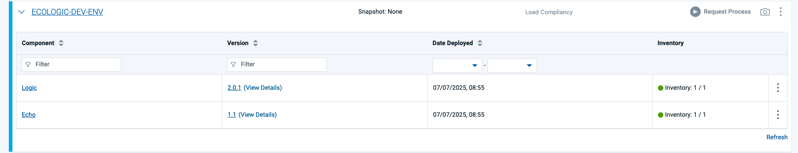
    7. Use Deploy Genie to understand why the deployment failed.
        1. TODO: update as soon as connected to openai to showcase Deploy Genie
    8. [Show the plug-ins page and explain how easy it is to integrate with 3rd parties out of the box](deploy/index.md#settings).
        1. Switch to Settings by using the Settings Icon: 
        2. 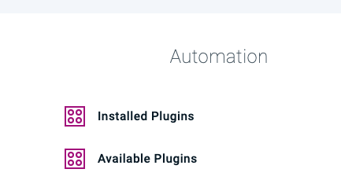
        3. 

## [Test](test/index.md)

1. [Open Test](test/index.md#how-to-switch-to-test-from-home-page)
    1. Explain that you are now playing the role of a tester
    2. Show the test landing page and metrics.
    3. Run integration test
    4. Run performance test
    5. Explain that our service might not be ready so switch on a virtual service.
    6. Run the tests again as a suite.
    7. Show the analysis of the test results.
    8. Show how we can create or edit a test.
    9. Generate test data
    10. Show a security test report.
    11. Run a new test that will fail.
    12. Create a defect in Plan and show that is has all the data automatically.
    13. Explain that everything is traceable.

## [Measure](measure/index.md)

1. [Open Measure](measure/index.md#how-to-switch-to-measure-from-home-page)
    1. Explain that we have built, deployed and tested so now we need to coordinate releases.
    2. Show and talk about pipeline(s) with environments and Gates
    3. Create simple new gate to show usage of metrics
2. [Release](release/index.md) - Show release overview with calendar
    1. Explain that we have been shoeing individual roles but we can look across roles and track the value of our delivery work.
    2. Open the VSM for the project
    3. Show the audit information of a dot.
    4. Show the swimlane view.
    5. So how do we ensure everyone understands the state of our project.  Well we can generate a release readiness report. – Generate the report.

## Genie

Explain that we have covered a lot of roles and used a mixture of AI and automation but we can bring it all together with what we call our Loop Genie

1. Open the Home page.
2. Click Loop Genie.
3. Ask xyz question.
4. Explain that we are back to the start and that this has been a quick end to end demo.
