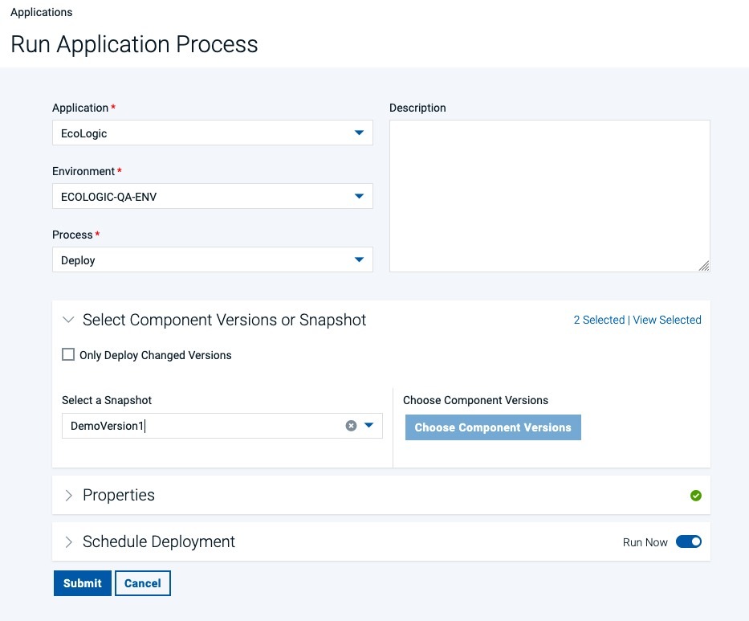

# Demo Flow

## [Loop](introduction/index.md)

| Step | Details                                                                                                       | Additional Information                |
|:----:|:--------------------------------------------------------------------------------------------------------------|:--------------------------------------|
|  1   | After loging in you will be on the [Home Page](introduction/index.md#the-home-page) of Loop                   | ![Home Page][HomePage]                |
|  2   | If you are not on the Home Page page, click on Home button in the side bar to switch to the Home Page         | ![Home Page Sidebar][HomePageSideBar] |
|  3   | The Home Page provides metrics and dashboards over all of my accessible Loops                                 |                                       |
|  4   | Showing data from Plan - Ratio of Issues created versus closed                                                | ![Plan Metric][PlanMetric]            |
|  5   | Number of Build Jobs failed and successeful finished                                                          | ![Build Metric][BuildMetric]          |
|  6   | Count of Deployments and how many of them were successfull or failed                                          | ![Deploy Metric][DeployMetric]        |
|  7   | Top contributors in Control                                                                                   | ![Control Metric][ControlMetric]      |
|  8   | Two DORA (DevOps Research and Assessment) metrics for                                                         |                                       |
|      | Lead Time: In general, lead-time reflects the time from the start of a project until its final disposition    | ![Lead Time][LeadTime]                |
|      | Cycle Time: In general, cycle-time reflects the time project elements take to resolve or complete             | ![Cycle Time][CycleTime]              |
|      | Find out more about [DORA Metrics here](https://www.ibm.com/docs/en/devops-velocity/5.1.0?topic=metrics-dora) |                                       |

## [Plan](plan/index.md)

### Plan Overview

| Step | Details                                                                                                                                                                      | Additional Information                                     |
|:----:|:-----------------------------------------------------------------------------------------------------------------------------------------------------------------------------|:-----------------------------------------------------------|
|  1   | [Open Plan][OpenPlan]                                                                                                                                                        |                                                            |
|      | You can switch to Plan by either pressing "Let's go to Plan" button on its tile                                                                                              | ![Plan Tile lets go][PlanTile]                             |
|      | Or you can always switch using the central app switcher on the top left of your screen                                                                                       | ![Central App Switcher][AppSwitcher]                       |
|  2   | [Show My board][ShowMyBoard]                                                                                                                                                 |                                                            |
|      | To open the board use the Project Board icon ![Board Icon in sidebar][ProjectBoardsIcon] on the sidebar                                                                      | ![sidebar][SidebarBoardIcon]                               |
|      | The initial view is your My Board view which will show worktitems that are assigned to you                                                                                   | ![myWork Board][MyWorkBoard]                               |
|  3   | [Show how to filter out Epics][HowToFilter]                                                                                                                                  | ![Board filter][FilterBar]                                 |
|  4   | [Show all work items][WorkItems]                                                                                                                                             | ![Board workitems][ProjectBoardWorkItems]                  |
|  5   | [Select and Show the details of a work item][SelectWorkItem]                                                                                                                 | ![Select WorkItem from Board][BoardSelectWorkItem]         |
|      |                                                                                                                                                                              | ![Show Workitem Details][BoardShowWorkItemDetail]          |
|  6   | [Show the link between work item to code and explain how easy it is to have traceability][ShowCommit]                                                                        |                                                            |
|      |                                                                                                                                                                              | ![PLAN - Show Control/Git Commit Link][PlanShowCommit]     |
|      |                                                                                                                                                                              | ![CONTROL - Show Git Commit Details][ControlShowCommit]    |

### Use Plan AI Assistant

| Step | Details                                                                                                                                                                      | Additional Information                                     |
|:----:|:-----------------------------------------------------------------------------------------------------------------------------------------------------------------------------|:-----------------------------------------------------------|
|  1   | [Use the AI Assistant][PlanAI]                                                                                                                                               |                                                            |
|  2   | Select the AI Assistant Icon ![AI Assistant Icon][PlanAIIcon] from the Sidebar                                                                                               | ![Sidebar][PlanSidebar]                                    |
|  3   | Accept the Terms of Service                                                                                                                                                  | ![Accept Terms][AcceptTerms]                               |
|  4  | The AI Assistant Chat Dialog opens                                                                                                                                           | ![AI Assistant Dialog][AIAssistantDialog]                  |
|  5  | Enter Now a prompt, you can use the example prompts or use the following one   Provide the necessary steps to implement a Keycloak solution in our enterprise application | ![Enter Prompt][AIEnterPrompt]                             |
|  6  | Click on the **Next** Button to proceed                                                                                                                                      | ![Next Button][AINextButton]                               |
|  7  | The Applying Prompts page is shown with several types                                                                                                                        | ![Applying Prompts][AIApplyingPromptsType]                 |
|  8  | Select **Generate Action Items** (click into the circle with the check mark)                                                                                                 | ![Generate Action Items][AIGenerateActionItems]            |
|  9  | This will generate a set of responses                                                                                                                                        | ![AI Responses][AIResponses]                               |
|  10  | Click the **Select** Button and select **Break Down into Titles**                                                                                                            | ![Select Button][AISelectButtonBreakDownintoTitles]        |
|  11  | This will convert the list of responses to a list with checkboxes                                                                                                            | ![AI Responses with Checkboxes][AIResponsesWithCheckboxes] |
|  12  | Select a few you like from the list                                                                                                                                          | ![AI Responses selected][AISelectedResponses]              |
|  13  | Click the **Select Record Type** Button                                                                                                                                      | ![Select Record Type][AISelectRecordTypeButton]            |
|  14  | to select **Workitem** from the list                                                                                                                                         | ![Select Workitem][AISelectWorkitemRecordtype]             |
|  15  | In the next Dialog  select the right **Project** and **Workitem Type**                                                                                                       | ![Record Creation Dialog1][AIRecordCreationDialogEmpty]    |
|  16  | for example **Project**: Echologic and **Type**: Epic                                                                                                                        | ![Record Creation Dialog2][AIRecordCreationDialogFilled]   |
|  17  | Press the **Create Records** Button to get the **Epics** created.                                                                                                            | ![Create Records Button][AICreateRecordsButton]            |
|  18  | A few seconds later all newly created records are now created                                                                                                                | ![Newly created Records][AINewlyCreatedRecords]            |
|  19  | Press **Done**  to finish using the AI Assistant                                                                                                                             | ![Done Button][AIDoneButton]                               |

<!-- [Open a workitem and use AI to create description and exploratory test information](plan/boards/index.md#use-ai-in-workitem) -->

## [Code](code/index.md)

1. Explain that we showed the link between a work item and the code in control.
2. [Now open CODE](code/index.md#how-to-switch-to-code-from-home-page) ( use VScode for now, Switch to DevOps Code later)
    1. [Use WCA to explain code and generate some new code](code/index.md#watsonx-code-assistant).
        1. 
        2. 
    2. [Push code and add comment with work item number](code/index.md#commit-code-with-wi).
        1. 
    3. [Open Control and show the update](#control).

## [Control](control/index.md)

1. [Open Control](control/index.md#how-to-switch-to-control-from-home-page)
    1. [Show the Update](control/index.md#show-activity-report) in the activity report of the repository
    2. Activity Report
        1. 
    3. Git Commit Details
        1. ![CONTROL - Show Git Commit Details][ControlShowCommit]

## [Build](build/index.md)

1. [Open Build](build/index.md#how-to-switch-to-build-from-home-page)
    1. [Show overview on build runs and results](build/index.md#build-project-runs)
        1. 
    2. [Show build process](build/index.md#build-process-detail)
        1. 
    3. [Show templates](build/index.md#templates)
        1. 

## [Deploy](deploy/index.md)

1. [Open Deploy](deploy/index.md#how-to-switch-to-deploy-from-home-page) by [Using the ‘What would you like to do today’ and select Deploy](deploy/index.md#what-would-you-like-to-do-today)
    1. [Show the landing page and explain the metrics](deploy/index.md#deploy-landing-page)
        1. 
    2. [Show process (components, app)](deploy/index.md#processes)
        1. Component Process: 
    3. [Edit process](deploy/index.md#process-designer)
        1. 
    4. [show a process which executes a TEST with setting quality tag on version.](deploy/index.md#adding-version-statuses)
        1. 
        2. TODO: add test script step as soon as TEST is ready
    5. [Run and view results of steps](deploy/index.md#run-a-deployment)
        1. 
        2. click on Request Process Button: 
        3. Request with Component Versions
            1. 
        4. OR Request with Snapshot
            1. 
    6. [Show result (environment and version changes of comp)](deploy/index.md#result-of-run).
        1. 
    7. Use Deploy Genie to understand why the deployment failed.
        1. TODO: update as soon as connected to openai to showcase Deploy Genie
    8. [Show the plug-ins page and explain how easy it is to integrate with 3rd parties out of the box](deploy/index.md#settings).
        1. Switch to Settings by using the Settings Icon: 
        2. 
        3. 

## [Test](test/index.md)

1. [Open Test](test/index.md#how-to-switch-to-test-from-home-page)
    1. Explain that you are now playing the role of a tester
    2. Show the test landing page and metrics.
    3. Run integration test
    4. Run performance test
    5. Explain that our service might not be ready so switch on a virtual service.
    6. Run the tests again as a suite.
    7. Show the analysis of the test results.
    8. Show how we can create or edit a test.
    9. Generate test data
    10. Show a security test report.
    11. Run a new test that will fail.
    12. Create a defect in Plan and show that is has all the data automatically.
    13. Explain that everything is traceable.

## [Measure](measure/index.md)

1. [Open Measure](measure/index.md#how-to-switch-to-measure-from-home-page)
    1. Explain that we have built, deployed and tested so now we need to coordinate releases.
    2. Show and talk about pipeline(s) with environments and Gates
    3. Create simple new gate to show usage of metrics
2. [Release](release/index.md) - Show release overview with calendar
    1. Explain that we have been shoeing individual roles but we can look across roles and track the value of our delivery work.
    2. Open the VSM for the project
    3. Show the audit information of a dot.
    4. Show the swimlane view.
    5. So how do we ensure everyone understands the state of our project.  Well we can generate a release readiness report. – Generate the report.

## Genie

Explain that we have covered a lot of roles and used a mixture of AI and automation but we can bring it all together with what we call our Loop Genie

1. Open the Home page.
2. Click Loop Genie.
3. Ask xyz question.
4. Explain that we are back to the start and that this has been a quick end to end demo.

---

[HomePage]: introduction/media/Loop_Home_Page.png
[HomePageSideBar]: introduction/media/Loop_Home_Page_SideBar.png
[PlanMetric]: introduction/media/LoopHome_Plan_metrics.png
[BuildMetric]: introduction/media/LoopHome_Build_Metrics.png
[DeployMetric]: introduction/media/LoopHome_Deploy_Metrics.png
[ControlMetric]: introduction/media/LoopHome_Control_metrics.png
[LeadTime]: introduction/media/LoopHome_LeadTime.png
[CycleTime]: introduction/media/LoopHome_CycleTime.png
[OpenPlan]: plan/index.md#how-to-switch-to-plan-from-home-page
[PlanTile]: introduction/media/Loop_switch_to_Plan.png
[AppSwitcher]: introduction/media/Loop_central_app_control.png
[ShowMyBoard]: plan/boards/index.md#project-board
[MyWorkBoard]: plan/boards/media/Plan_ProjectBoard_myBoard.png
[ProjectBoardsIcon]: plan/boards/media/Plan_ProjectBoard_Icon.png
[SidebarBoardIcon]: plan/media/Plan_Sidebar_ProjectBoards.png
[HowToFilter]: plan/boards/index.md#filter-epics
[FilterBar]: plan/boards/media/Plan_ProjectBoard_Filterbar.png
[WorkItems]: plan/boards/index.md#work-items
[ProjectBoardWorkItems]: plan/boards/media/Plan_ProjectBoard_WorkItems.png
[SelectWorkItem]: plan/boards/index.md#select-workitem
[BoardSelectWorkItem]: plan/boards/media/PLAN_Boards_SelectWI.png
[BoardShowWorkItemDetail]: plan/boards/media/PLAN_Board_ShowWI_Detail.png
[ShowCommit]: plan/boards/index.md#show-commit
[PlanShowCommit]: plan/media/PLAN_Show_GitCommit.png
[ControlShowCommit]: control/media/CONTROL_ShowGitCommit.png
[PlanAI]: plan/index.md#ai-assistant
[PlanAIIcon]: plan/media/PLAN_AI_assistant_Icon.png
[PlanSidebar]: plan/media/PLAN_Sidebar.png
[AcceptTerms]: plan/media/PLAN_AI_accept_Terms.png
[AIAssistantDialog]: plan/media/PLAN_AI_Dialog1.png
[AIEnterPrompt]: plan/media/PLAN_AI_enter_prompt.png
[AINextButton]: plan/media/PLAN_AI_NextButton.png
[AIGenerateActionItems]: plan/media/PLAN_AI_Generate_Action_Items.png
[AIApplyingPromptsType]: plan/media/PLAN_AI_UserInputType.png
[AIResponses]: plan/media/PLAN_AI_to_create_Items.png
[AISelectButtonBreakDownintoTitles]: plan/media/PLAN_AI_SelectButton_List.png
[AIResponsesWithCheckboxes]: plan/media/PLAN_AI_select_items.png
[AISelectedResponses]: plan/media/PLAN_AI_select_items2.png
[AISelectRecordTypeButton]: plan/media/PLAN_AI_select_record_type.png
[AISelectWorkitemRecordtype]: plan/media/PLAN_AI_recordtype_workitem.png
[AIRecordCreationDialogEmpty]: plan/media/PLAN_AI_recordtype_Dialog1.png
[AIRecordCreationDialogFilled]: plan/media/PLAN_AI_recordtype_Dialog2.png
[AICreateRecordsButton]: plan/media/PLAN_AI_create_records_button.png
[AINewlyCreatedRecords]: plan/media/PLAN_AI_records_created.png
[AIDoneButton]: plan/media/PLAN_AI_done.png
