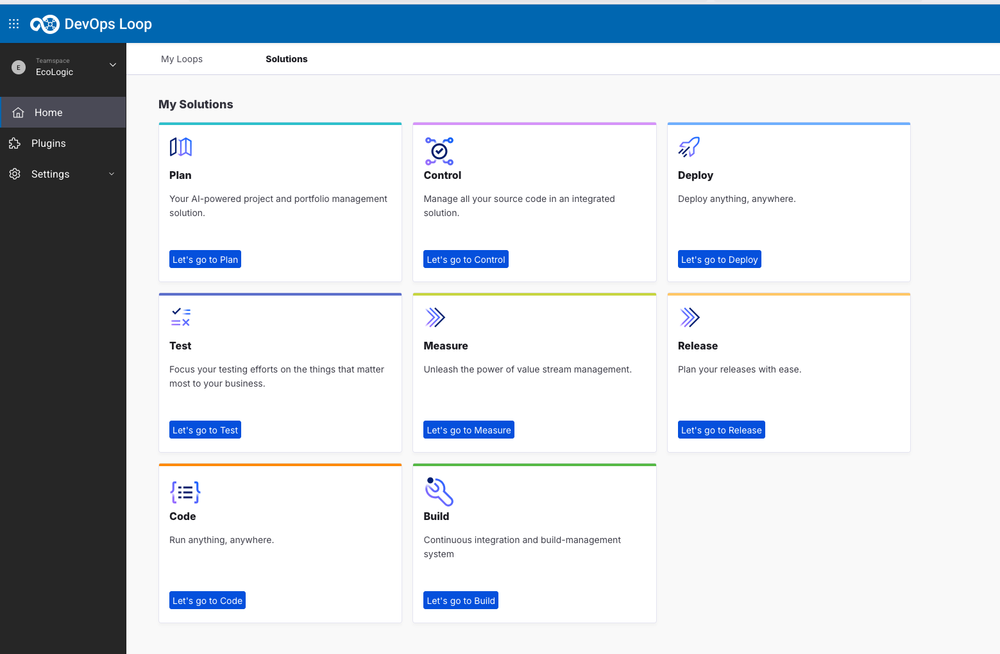

# Introduction

TODO: update flow, app references and screenshots.
TODO: Pre created account needed.
_**TODO: update flow, app references from PIZZA to EcoLogic and screenshots**_

## Start Here

To use the platform you have to be onboarded onto it. This is normaly done by your administrators. For this lab we have provided you with pre created accounts.

### How to log in

Please navigate to the given URL and enter your provided credentials in the Login Screen:

and press the Sign In Button.

### The Home Page

After you have been logged in you will be directed to your homepage and it will provide you an overview about metrics from your Loops:

By clicking on the **Solutions** button on the top the Solutions tiles will be shown:

On this page the available capabilities of the platform will be provided for you. By clicking on the "Let's go to ..." button(s) the capability provider will be opened in a new tab of your browser.

You can switch directly to the capability/solution by using the button/link

or by using the central app switcher on the top left:

## Creation of a Teamspace and Loops

In the case of an empty environment you need to create a new Teamspace and at least one Loop. Please follow the [Instructions for creating Teamspace(s)](teamspace/index.md) and the [Instructions for creation of a new Loop](loops/index.md)

## Conclusio

If you want to talk more about Loop please have a look at the [About Box, Sidebar and Plug-Ins](intro/index.md) introduction.
