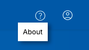
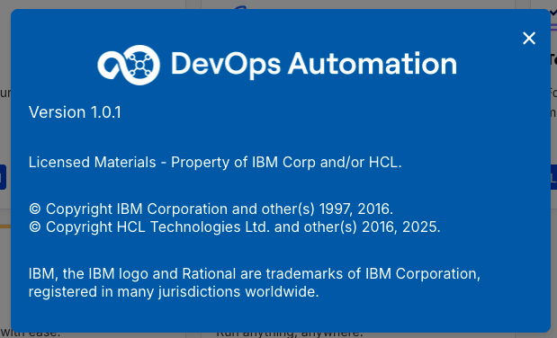
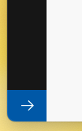

# Introduction

TODO: update flow, app references and screenshots
_**TODO: update flow, app references from PIZZA to EcoLogic and screenshots**_

## Start Here

To use the platform you have to be onboarded onto it. This is normaly done by your administrators. For this lab we have provided you with pre created accounts. These will be handed out to you at the lab session.

### How to log in

Please navigate to the given Labsession URL and enter your provided credentials in the Login Screen:

and press the Sign In Button.

### The Home Page

After you have been logged in you will be directed to your homepage and it will provide you an overview about metrics from your Loops:

By clicking on the **Solutions** button on the top the Solutions tiles will be shown:

On this page the available capabilities of the platform will be provided for you. By clicking on the "Let's go to ..." button(s) the capability provider will be opened in a new tab of your browser.

Another way to switch between capabilities is to use the central app switcher:

### About Box and Logging out

On the above right side of your page you have the buttons for viewing the About box:

By pressing the About button the Information about the platform version and copyright will be presented. Please close by clicking on the "x" symbol on popup.

You can always log out of the platform by pressing the user symbol:

After a secure log out you will be presented with a new page which provides a login again:

### Sidebar

On the left side of the page you will have the side bar which will provide context related menu:

You can expand the side bar with the expand button on the bottom left side of the page:

Which will provide the sidebar items with text details:

### Plug-Ins

On the sidebar a view of slected plug-ins is available. By pressing on the Plug-Ins symbol the Featured Plugins page will be presented:

## Creation of a Teamspace and Loops

In the case of an empty environment you need to create a new Teamspace and at least one Loop. Please follow the [Instructions for creating Teamspace(s)](teamspace/index.md) and the [Instructions for creation of a new Loop](loops/index.md)

## Conclusio

Congratulations! You have now explored the home page of DevOps Loop. Please proceed with the next lab.
