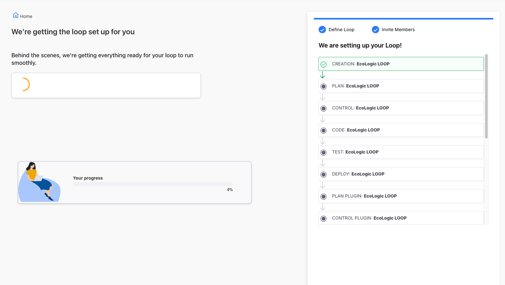
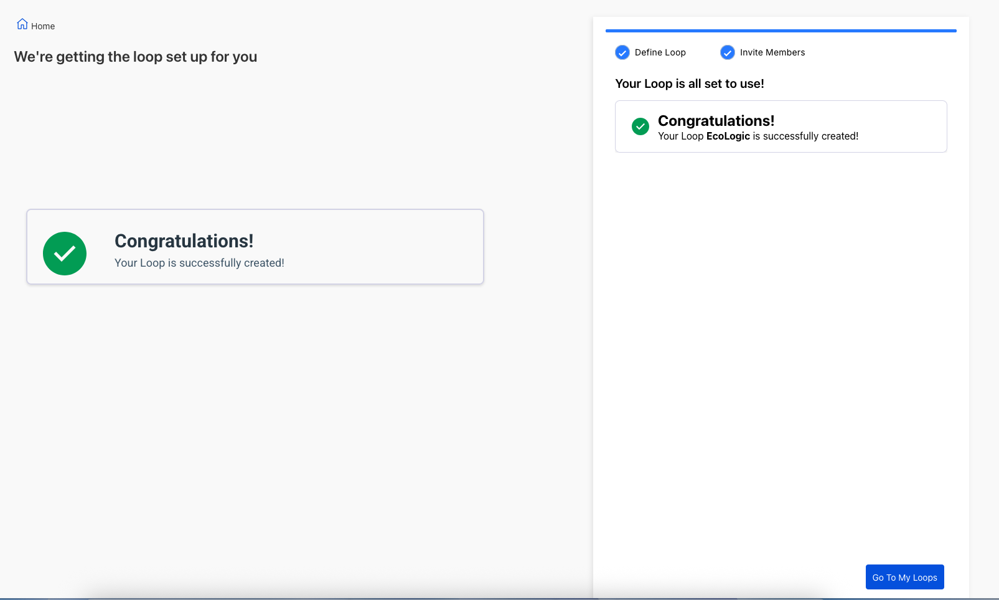

# Loops

TODO: update flow, app references and screenshots

## Overview

_**What are Loops**_

## Create new Loop

A new Teamspace does not have any Loop so we need to create one.

Search and add a Teammember to the Loop:

Loop creation can take a few moments, as soon as it finishes a Success screen will be shown:

