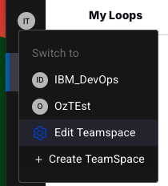
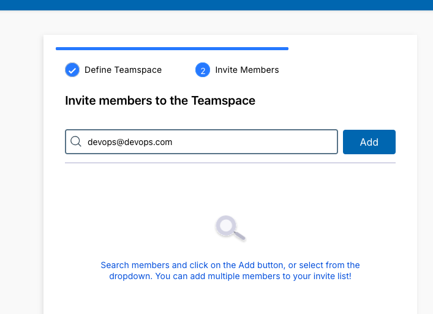
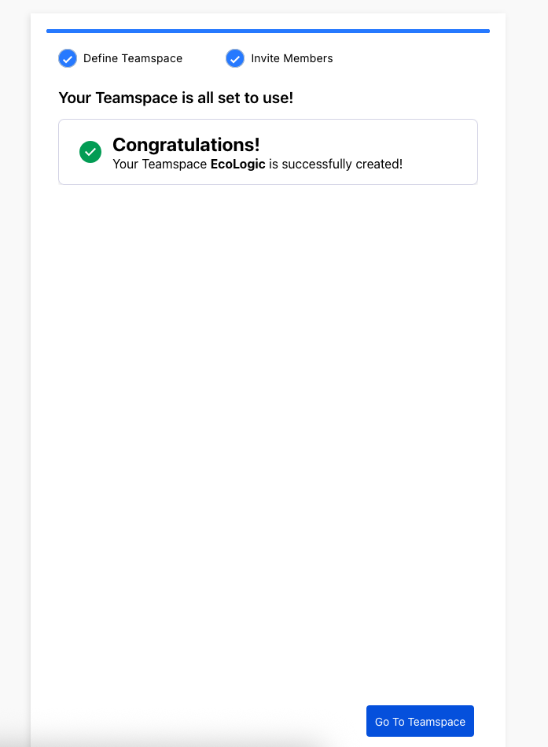

# Teamspace

TODO: update flow, app references and screenshots

## Overview

_**What are Teamspaces**_

## Create new Teamspace

Click on the Teamspace menue to view your Teamspaces or create a new one:

Enter the name and a Description:

You can search and add Teammembers to a Teamspace:

Teamspace createion will take a few moments, as soon as it finishes a success dialog will be shown:

