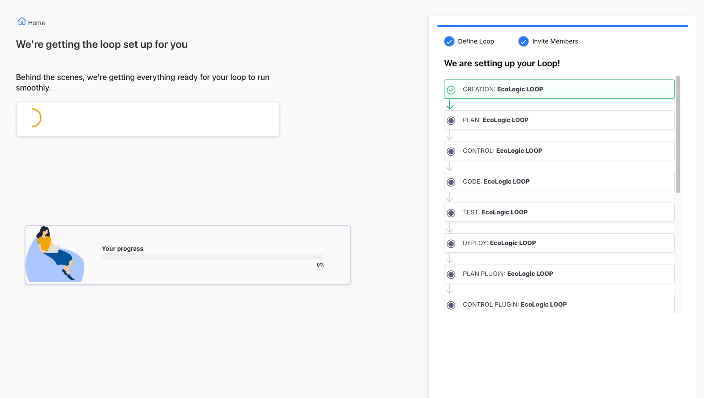

# Teamspace and Loops

TODO: update flow, app references and screenshots

## Overview

_**What are Teamspaces and Loops**_

## Create new Teamspace and a Loop

### Create a new Teamspace

- 
- 
- 
- 
- 
- 

### Create a new Loop

- 
- 
- 
- 
- 
- 
