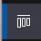

# Boards

## Work with Boards

### Project Board

Project Boards provide a graphical Kanban style overview of worktitems.

TODO: add more text here

To open the board use the Project Board icon  on the sidebar.

The initial view is your My Board view which will show worktitems that are assigned to you. As we newly started the board is empty.

TODO: add text how to switch to different plan - app (for example PIZZA) and show around the data

- 
- 
- 
- 
- 
- 
- 