# Plan Lab

TODO: update flow, app references and screenshots
_**TODO: update flow, app references from PIZZA to EcoLogic and screenshots**_

## Introduction

TODO: add here more about Plan

## How to switch to Plan from Home Page

You can switch to Plan by either pressing "Let's go to Plan" button on its tile:

Or you can always switch using the central app switcher on the top left of your screen:

## Let's go with Plan

### Select Plan application to use

If you have not set your default Plan application you will be provided with a screen with all applications you have access to.

Set the provided app as default and presss "Let's go" to proceed.

### Welcome Page for first time users

If you have logged in the first time into Plan you will get a Welcome Screen:

By pressing the button "Explore" a new page is shown which provides an Introduction to Plan and the used workflow model for the selected application:

### Use Home Button to switch to Plan Home Page

Please use the "Home" button on the left sidebar to switch to the Home page for Plan.

This Home page will provide you some basic information and also the means to switch between Plan applications (My Applications Button on the right)

The explore options on this page will forward you to the Exploration page mentioned above.

### Explore the technical worflow

Pressing the button "View":

will open a new view to the technical details of the used workflow for the selected application.

This view provides the used record types, fields, transition matrizes and more.

## Work with Boards

### Project Board

Project Boards provide a graphical Kanban style overview of worktitems.

TODO: add more text here

To open the board use the Project Board icon  on the sidebar.

The initial view is your My Board view which will show worktitems that are assigned to you. As we newly started the board is empty.

## Create and customize a new Project

### Create a new Project

To create a new Workitem you have to click on the triangle icon on the NEW button on the top right of your screen:

Select Project from the List. This will create a new Record from type "Project" and will show you its Main section first to provide Name and more Details:

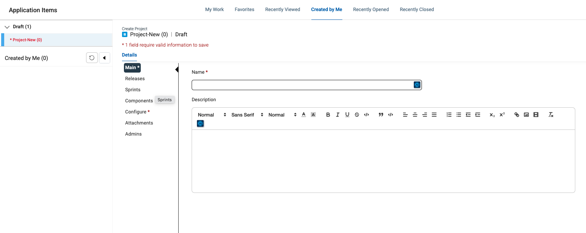

The name of our project is "EcoLogic", add a meaningful description too.

### Add Releases to Project

If you have saved the Project, you need to switch back to edit mode by using the Edit Button 

Switch to Releases Section and press the NEW button right of the Search field:

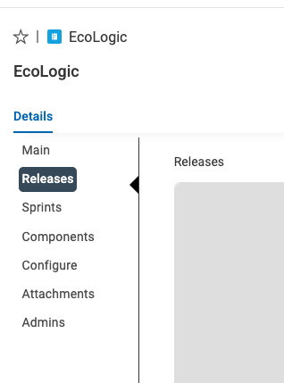

Enter "Release 1" into the Release Name and add a meaningfull description, you can change the Start and End Date if you wish.

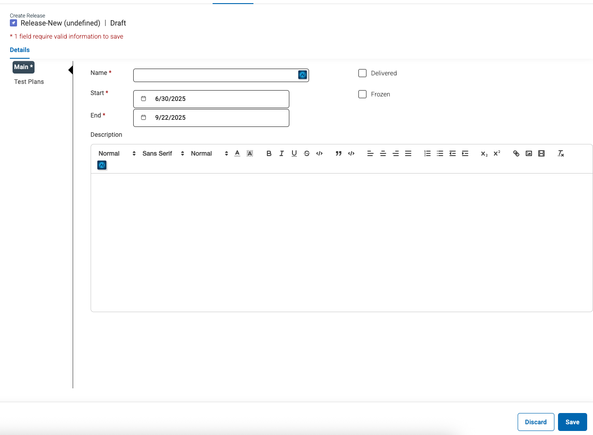

Press the SAVE button to save the new Release:

Please now repeat the steps to create "Release 2" which starts 1 day after "Release 1" ends and lasts for another 3 months.

In your release section you will now see your new releases:

If the Save button is active for the project, please press it to save your changes!

### Add Sprints to Project

If you have saved the Project, you need to switch back to edit mode by using the Edit Button 

As no Sprints have been created and attached to this Project the Sprint section is empty.

If you have saved the Project, you need to switch back to edit mode by using the Edit Button 

In the new Dialog/form enter the Sprint name "Sprint 1" and if necessary adjust the Start and End Date:

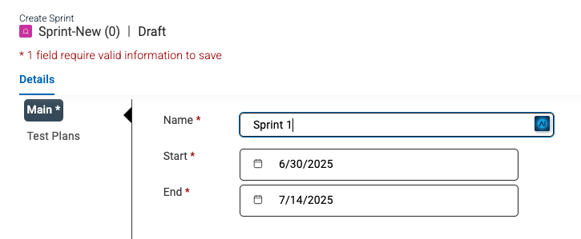

Press the Save Button  to save this new Sprint. Now the Sprint is visible in the Sprintlist of the Project:

Repeat this steps and create more Sprints and adjust their Start and End Dates accordingly.

Example with two Sprints:

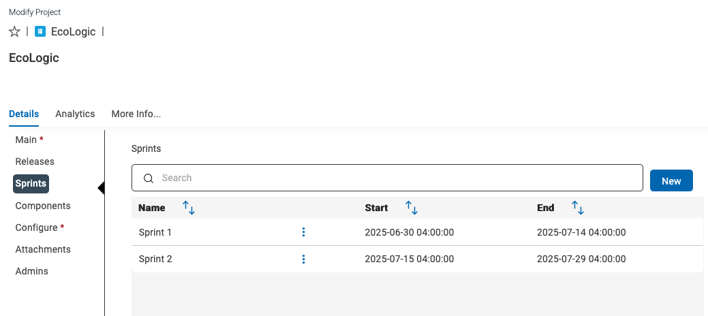

Please do not forget to save the project changes!

### Configure Project

If you have saved the Project, you need to switch back to edit mode by using the Edit Button 

Click on the sidebar on the "Configure" button/link:

This screen lets you customize your project with different values for Work Item Types, Priorities, Story Points, Severities, Resolutions, Tags and Release Types. New values can be added by clicking in the white space, typing in a value and clicking the Create link that appears below. Existing values can be removed by clicking the X beside the value

In the Workitem Types remove the Hill, SubHill and Scenario work item types. You can add or remove other items based on your requirements, the new configuraiton should look like this:

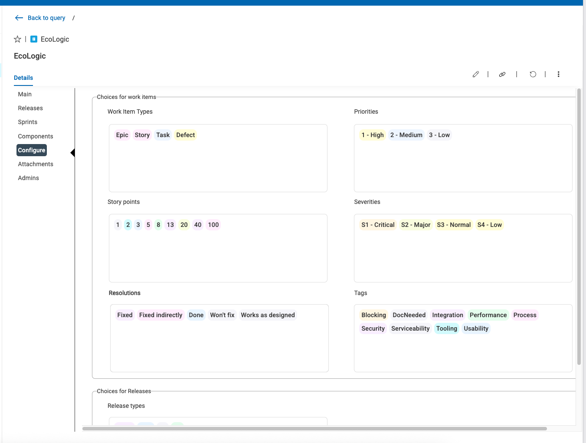

Click the Save button on the lower right of the screen: 

### Add Components

If you have saved the Project, you need to switch back to edit mode by using the Edit Button 

Click on the sidebar on the "Component" button/link:

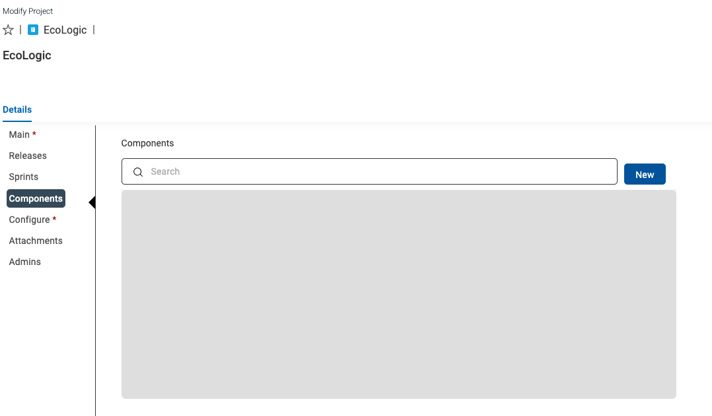

Click on the "NEW" button to create a new component "EcoDriver":

Save the component and create another one for "LogicDriver".

The new component list should look like this:

Do not forget to save the project to keep the changes!

## Work with Queries

Use Queries to get a list of items you are interested on. Every user can create its own Personal Queries. If you have the role or permission set to be a Public Query Editor then you can publish personal queries as Public Queries.

### Public and Personal Queries

You can switch to the Query Editor by either Clicking on the Queries icon on the left sidebar to open the submenue:

Or when your sidebar is expanded click on Personal to create a new Personal Query:

The Query Editor list all your queries you have access to. You can switch here between Personal and Public queries by clicking on the triangle symbol right beside the Public/Personal Query:

#### create new personal query

Now let us create a simple Query to list all Projects we own. Click on the Add New Query button and select "New Query":

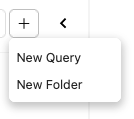

This will open a Popup where you need to provide a name for your query and which record type will be queried:

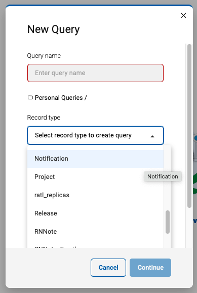

Please provide a meaningful name like "My Project Query" and select the Project record type. Then Press Continue to open the Query Editor:

In this Editor you can configure the fields which will be shown on the result. It is also possible to add fields from related record types like Releases or Sprints. In this example we will keep it Simple and add only the Tagslist to our Result set.

Scroll down on fields list to Tags and press the arrow to add it to your result field view:

In the results field view you can change the ordering of the fields, set the sort order and more. Every field reveals a three dot inline menue for modification of these parameters or if you added it by mistage to remove this field from this list.

Now let us do a dry run and see the results. Press the Run button on the bottom right of your screen to run and have a look at the result:

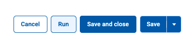

Use the "Back to Edit" link to return to the Query Editor to add aditional fields or change the query:

We need to add a Filter on our Query so that only our own items are selected. This can be done by clicking on the Query Filter link on the top above the field list:

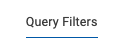

In this view select Owner from the field list and press the arrow button to add it to the Filter Criteria, then you need to change the value to "Current User":

NOTE: you could have selected your own username from the list, but to if you want to publish this query, you can use the generic "Current User" which will automatically use the username of the logged in user.

We are now finished with setting up our query. Press Save and Close on the bottom left:

If you want to save and go on with editing use the Save button. It can be also used for saving your query under a new name too:

#### Public Queries

Have a look at the available Queries in the Public Queries list and try them out.

## Conclusio

Congratulations! You have finished the Plan lab and have got a short overview of its capabilities.
