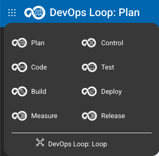
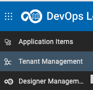
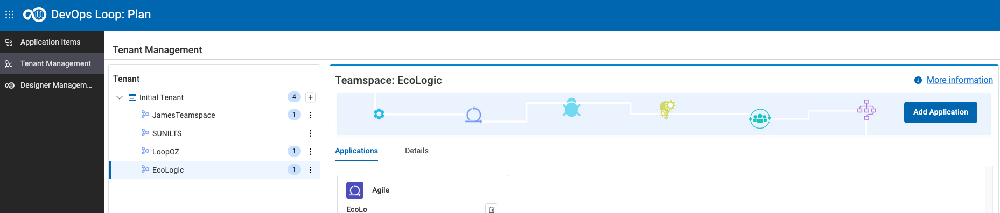
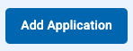
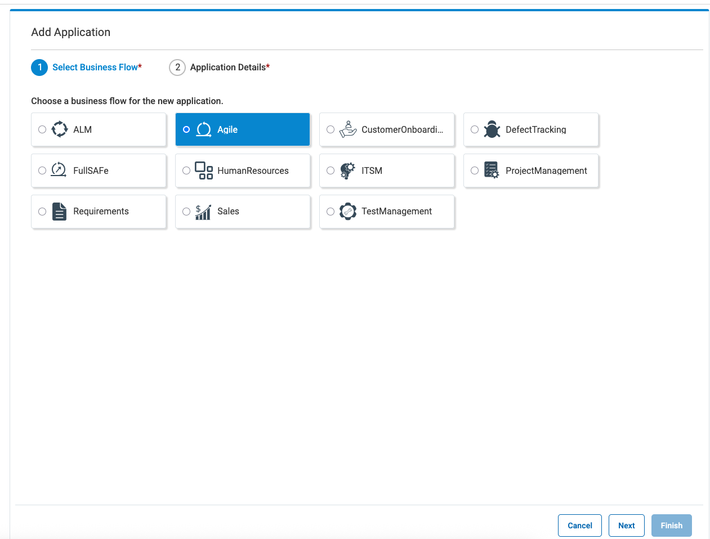
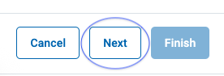
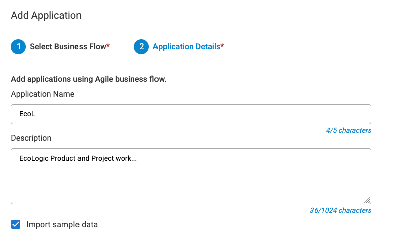
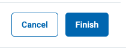
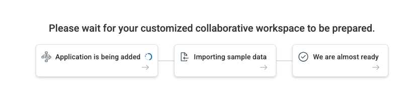
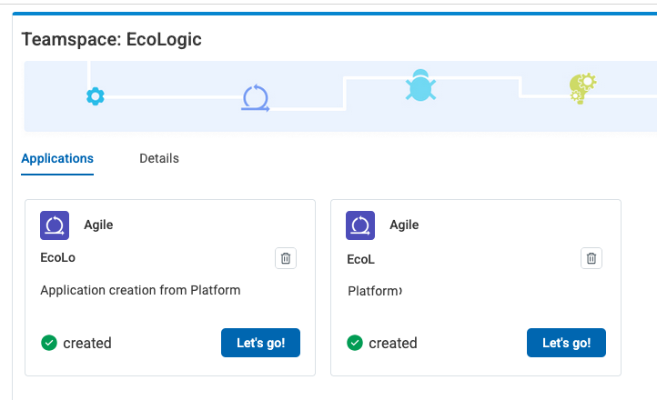

# Create new Application

## Switch to Tenant View

Use the Dots Menue  to select PLAN to view the Applications you have access to.

Click on the Tenant Management  Button/Link to manage your Application for your Tenants.

Select your Tenant EchoLogic and view your Applications:

## Create a new Application

### Add a new Application

In this view click the Add Application Button  to start creating a new Application in Plan.

Select the best fitting schema/workflow, in this case we use "Agile":

Click on Next to Provide Name and Description, and select the "Sample Data" checkbox to have some data to show:

Click on Finish button to start creation of the Application and importing the Sample Data:

Now you have a new Application with some Sample Data:

